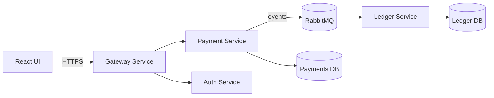

# payment-processing
## Goal: 
Simulate a payment flow end-to-end to learn system design + microservices

## Use cases: 
Create Payment, Authorize, Capture, Refund, View Transaction, Basic Fraud Rule

## Services (v1):
- gateway-service (edge API)
- payment-service (payment state machine + idempotency)
- ledger-service (append-only ledger, consumes events)
- auth-service (JWT)
- message-bus (Kafka)

**Non-goals** (v1): PCI, real card storage, real money movement

## Architecture Diagram

