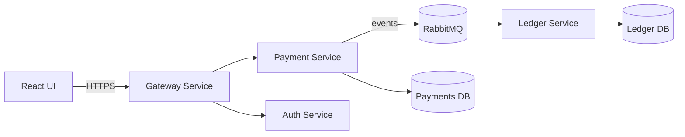

# payment-processing
## Goal: 
Simulate a payment flow end-to-end to learn system design + microservices

## Use cases: 
Create Payment, Authorize, Capture, Refund, View Transaction, Basic Fraud Rule

## Services (v1):
- gateway-service (edge API)
- payment-service (payment state machine + idempotency)
- ledger-service (append-only ledger, consumes events)
- auth-service (JWT)
- message-bus (RabbitMQ)

**Non-goals** (v1): PCI, real card storage, real money movement, no synchronous service-to-service business coupling (prefer async events)

## Architecture Diagram

## MVP Flow # 1: Create Payment
- Client calls POST /api/payments
- Gateway forwards to payment-service
- payment-service validates + creates payment with status CREATED
- payment-service returns {paymentId, status}
- (later) payment-service publishes PAYMENT_CREATED event
- (later) ledger-service consumes and writes ledger entry

## Next build step:
- Boot payment-service (Spring Boot + Gradle)
- Add POST /payments
- Persist to Postgres (Docker compose)
- Return paymentId + status
  
## Payment Service - Phase 1
- Spring Boot (Gradle)
- Payment entity
- JPA repository
- POST /payments
- Dockerized Postgres

## 01/11/2026 Tasks:
- Generate Spring Boot using Gradle + Java 17 (done)
- Create docker-compose.yml with Postgres service (done)
- Wire Spring Boot to Postgres (done)

## 01/12/2026 Tasks:
- Design Payment entity (fields + constraints)
- Create repository interface

